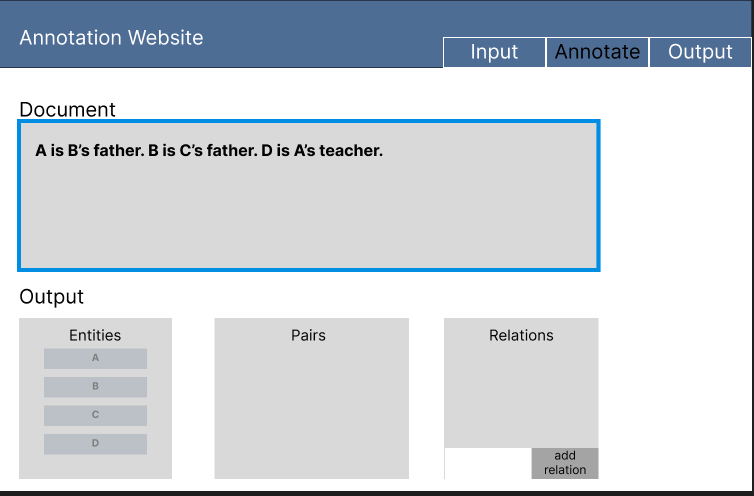
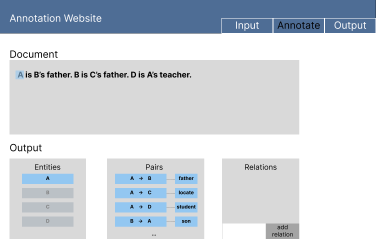

# relation-annotator

A website for relational annotation.

## Introduction

We will use react for frontend and flask/django for backend.

wireflow: https://www.figma.com/file/DILE8TeJ0UboAlK3qt93RM/Capstone?node-id=64%3A41

## Pages

### Annotate /annotate/doc_id

Should have the following parts:
* a banner for name of the website, a panel for switching to input and output  
* a textbox for showing the document  
* list of entities  
* list of pairs colored to show the importance  
* list of possible relations  
* a text box for adding the relations 
* if select words, give a button for adding the entity   

**from backend:**  
* fetch {doc_id: , entities: \[,\], pairs: \[, \]}  
* post {doc_id: , "entity": \{"pos": , "content": \}}  

### Annotate /annotate/doc_id?entity1=A&entity2=B

If click entity, filter the pairs and show the pairs related. Also highlight the text in the document box

If there's pairs selected, prompt option for confirm the selection

